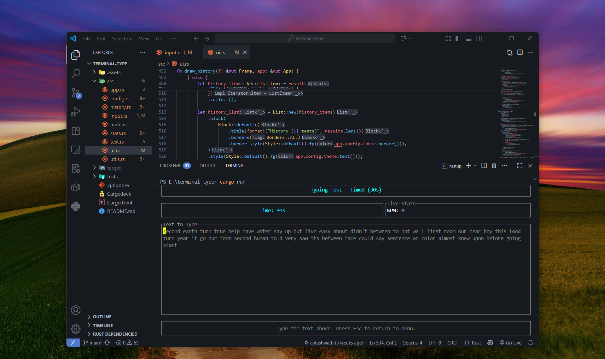

# Terminal Type

A **terminal-based typing test** application built with **Rust**, featuring multiple test modes, detailed statistics, and customizable themes.

<p align="center">
  
</p>

---

## ✨ Features

### 📝 Test Modes

- **Timed Mode**: Test your typing speed for 30, 60, or 120 seconds  
- **Word Count Mode**: Type a specific number of words (25, 50, or 100)  
- **Custom Text Mode**: Practice with your own text  

### 📊 Statistics & Analytics

- **Real-time Metrics**: Live WPM and accuracy tracking during tests  
- **Detailed Results**:  
  - Words Per Minute (WPM) and Raw WPM  
  - Accuracy percentage  
  - Error count and character statistics  
  - Consistency score  
  - Most common typing errors  
- **Historical Data**:  
  - View past test results  
  - Track improvement over time  
  - Personal best records  
  - Average statistics  

### 🎨 Customization

- **Multiple Themes**:  
  - Dark (default)  
  - Light  
  - Monokai  
  - Solarized Dark  
  - Dracula  
- **Configurable Settings**: Customize test parameters and keybindings via a TOML config file  

---

## ⚙️ Installation

### Prerequisites

- Rust **1.70** or higher  
- Cargo  

### Building from Source

```bash
git clone https://github.com/yourusername/terminal-type.git
cd terminal-type
cargo build --release
```

### Running

```bash
cargo run --release
```

Or run the binary directly:

```bash
./target/release/terminal-type
```

---

## 🎮 Usage

### Navigation

- **Arrow Keys** or **j/k**: Navigate menus  
- **Enter**: Select menu item  
- **1-4**: Quick select menu items  
- **q**: Quit (from menu screens)  
- **Esc**: Return to menu (from test/results screens)  

### During Test

- Type the displayed text as accurately and quickly as possible  
- **Backspace**: Correct mistakes  
- **Esc**: Abort test and return to menu  

### After Test

- **r**: Restart test with same mode  
- **m**: Return to main menu  

---

## ⚙️ Configuration

Configuration file location:

- **Linux/macOS**: `~/.config/typing-test/config.toml`
- **Windows**: `%APPDATA%\typing-test\config.toml`

### Example Configuration

```toml
[theme]
name = "Dark"

[theme.text]
r = 255
g = 255
b = 255

[test_settings]
default_mode = "Timed30"
default_duration = 30
default_word_count = 25
sound_enabled = false
show_live_wpm = true
show_live_accuracy = true

[keybindings]
quit = "q"
restart = "r"
menu = "m"
next_mode = "Tab"
```

---

## 💾 Data Storage

Test history is stored in:

- **Linux/macOS**: `~/.local/share/typing-test/history.json` or `~/.config/typing-test/history.json`
- **Windows**: `%APPDATA%\typing-test\history.json`

👉 History is limited to the most recent 1000 tests.

---

## 📦 Dependencies

- **ratatui**: Terminal UI framework
- **crossterm**: Cross-platform terminal manipulation
- **serde**: Serialization/deserialization
- **toml**: Configuration file parsing
- **chrono**: Date and time handling
- **rand**: Random word generation
- **anyhow**: Error handling

---

## 📂 Project Structure

```
src/
├── main.rs           # Application entry point
├── app.rs            # Core application state and logic
├── config.rs         # Configuration management and themes
├── history.rs        # Test history and statistics tracking
├── input.rs          # Keyboard input handling
├── stats.rs          # Statistics calculation and analysis
├── test.rs           # Test mode implementation
├── ui.rs             # Terminal UI rendering
└── utils.rs          # Utility functions (word generation, etc.)
```

---

## 🔍 Features in Detail

### Word Generation

- Common words from a curated list of 300+ frequently used English words
- Challenging words for advanced practice
- Programming-specific vocabulary
- Support for custom difficulty levels

### Statistics Tracking

- **WPM Calculation**: Standard 5-character word metric
- **Accuracy**: Percentage of correctly typed characters
- **Error Frequency**: Track which characters cause the most mistakes
- **Speed Over Time**: Monitor typing speed progression throughout the test
- **Consistency Score**: Measure typing rhythm stability

### Themes

All themes include customizable colors for:

- Text and background
- Correct and incorrect characters
- Cursor position
- Borders and highlights
- Muted/secondary text

---

## 🤝 Contributing

Contributions are welcome!

1. Fork the repository
2. Create a feature branch (`git checkout -b feature-name`)
3. Commit changes (`git commit -m "Added new feature"`)
4. Push to the branch (`git push origin feature-name`)
5. Submit a Pull Request

---

## 📜 License

This project is licensed under the MIT License – see the LICENSE file for details.

---

## 🚀 Roadmap

- Online leaderboards
- Custom text import from files
- More detailed finger-specific statistics
- Practice mode for problem characters
- Multiplayer/race mode
- Sound effects (configurable)
- More themes
- Graph visualizations for progress

---

## 🙏 Acknowledgments

Inspired by MonkeyType and other typing test applications

Built with the excellent Ratatui TUI framework